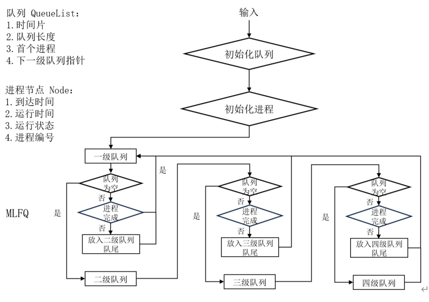
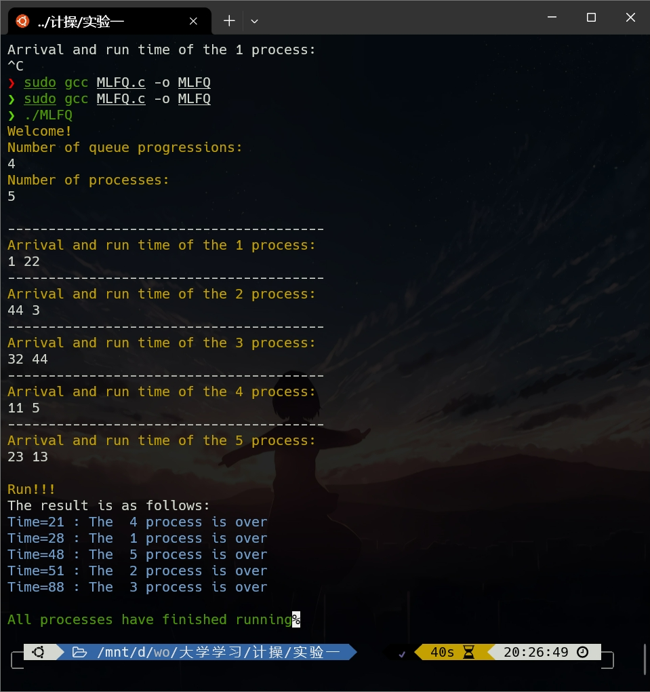

# 实验一：多级反馈队列调度算法

## 实验目的

通过模拟多级反馈队列进程调度算法，加深对进程调度算法、分时系统、时间片、进程优先级、进程状态、进程控制的理解。

## 实验内容

用C语言或Python编写一个程序，模拟多级反馈队列调度算法的执行过程，要求：

1. 队列4级，每一级的队列长度都为 10，第一级的时间片为 T，第二级的时间片为 2T，第三级的时间片为4T，第四级的时间片为 8T；（T的大小自己定）

2. 立即抢占的调度算法；

3. 要有：在调度n级（n>1）队列时，有新来的进程进入系统。

## 程序流程图



## 程序代码

本次使用了C语言进行程序编写，开发环境：Ubuntu 20.04，主要代码如下：

### 结构体与变量

#### 进程

```c
typedef struct Node
{
	int ArrivalTime; // 到达时间
	int WorkTime;	 // 服务时间
	int number;		 // 到达顺序
	int flag;		 // 0等待，1运行完成
	struct Node *next;
} Process;
```

#### 多级队列

```c
typedef struct QueueList
{
	int TimeSlice;			// 时间片
	int length;				// 队列长度
	Process *front;			// 队列第一个进程指针
	struct QueueList *next; // 下一个队列
} Queue;
```

#### 其他

```c
Queue *head = NULL; 	// 多级队列头节点
Queue *QLists[50]; 		// 多级队列
Process *Finish = NULL; // 已完成
int time = 0; 			// 运行时间
int Maxsize = 4; 		// 队列级数
```

### 函数

#### 初始化队列

```c
void InitQueue()
{
	yellow_printf("Welcome!\n");
	printf("Number of queue progressions:\n");
	scanf("%d", &Maxsize);
	Queue *temp;
	int count = 1;
	for (int i = 0; i < Maxsize; i++)
	{
		temp = (Queue *)malloc(sizeof(Queue));
		temp->front = NULL;
		if(i==0)
		{
			temp->TimeSlice=T;
			count *= 2;
		}
		else
		{
			temp->TimeSlice = T*count; // 设置各级队列时间片，当前时间片T，2T，4T，8T...
			count*=2;
		}
		temp->length = 10;				 // 限制队列过长，以免出现饥饿问题
		temp->next = NULL;
		if (head == NULL)
		{
			head = temp;
			temp = NULL;
		}
		else
		{
			Queue *temp2;
			temp2 = head;
			while (temp2->next != NULL)
			{
				temp2 = temp2->next;
			}
			temp2->next = temp;
			temp = NULL;
		}
	}
}

```

#### 初始化进程

```c
void InitProcess()
{
	int num;
	printf("Number of processes:\n");
	scanf("%d", &num);
	while (num > 10)
	{
		red_printf("Exceed the queue length!\n");
		yellow_printf("Please re-energize ...\n");
		scanf("%d",&num);
	}
	Process *temp;
	printf("\n");
	for (int i = 0; i < num; i++)
	{
		temp = (Process *)malloc(sizeof(Process));
		printf("---------------------------------------\n");
		printf("Arrival and run time of the %d process:\n", i + 1);
		scanf("%d %d", &temp->ArrivalTime, &temp->WorkTime);
		temp->flag = 0;
		temp->next = NULL;
		temp->number = i + 1;
		if (head->front == NULL)
		{
			temp->next = NULL;
			head->front = temp;
		}
		else
		{
			Process *temp2;
			temp2 = head->front;
			while (temp2->next != NULL)
			{
				temp2 = temp2->next;
			}
			temp->next = NULL;
			temp2->next = temp;
		}
	}
}
```

#### 其他

```c
void SortProcess(); // 按到达时间排序
void RunFirstProcess(Queue *Q)； // 运行 Q 队列的首进程
void Insert2NextQueue(Process *P, Queue *Q)； // 将进程 P 插入 Q 队尾
```

#### 调度算法

```c
void MLFQ()
{
	QLists[1] = head;
	for (int i = 2; i <= Maxsize; i++)
	{
		QLists[i] = QLists[i - 1]->next;
	}
	
	// 保证结束的时刻
	if (QLists[1]->front != NULL)
	{
		time = QLists[1]->front->ArrivalTime;
	}

	while (1)
	{
		// 定义一个标志变量，表示是否有进程运行，0表示没有进程运行
		int flag = 0;
		for (int i = 1; i <= Maxsize; i++)
		{
			// 检查每个队列的第一个进程是否满足运行条件
			if (QLists[i]->front != NULL && time >= QLists[i]->front->ArrivalTime)
			{
				RunFirstProcess(QLists[i]);
				// 将标志变量设为1，表示有进程运行
				flag = 1;
				break;
			}
		}
		// 如果标志变量为0，表示没有进程运行
		if (flag == 0)
		{
			int j=1;
			for(j=1;j <= Maxsize;j++)
			{
				if(QLists[j]->front != NULL) break;
			}
			// 判断是否所有进程都运行完毕
			if (j==Maxsize+1)
			{
				green_printf("\nAll processes have finished running");
				break;
			}
			else
			{
				// 如果不是，就增加时间并继续循环
				time++;
				continue;
			}
		}
	}
}
```

## 运行结果

#### 代码创新点

1. 该程序可自定义队列级数，本实验为四级队列
2. 程序输出字体颜色根据提示信息有所不同



## 规范性输入

本实验要求每一级队列长度为 10


## 遇到问题

#### 问题 1 

首次编写程序时，未考虑进程到达时间的先后，即进程 1 的到达时间大于进程 2 的情况，导致运行结果出错

#### 解决方案 1

在进入调度函数之前，依据进程到达时间进行一次快排

#### 问题 2

当进程 1 运行结束，但进程 2 还未到达时，在主循环中没有更新运行时刻，导致运行结果出错

#### 解决方案 2 

主循环添加时刻 Time 的自增

## 结果分析

上文中的测试用例为

```html
进程号    		到达时间		运行时间
  1				 1			   22
  2				44			   3
  3				32             44
  4				11			   5
  5				23			   13
```

四级队列时间片分别为 1，2，4，8

1. 进程 1 最先到达，运行 1 个时间片后，没有进程到达，进入二级队列继续运行......
2. 直到进程 4 在 T = 11时到达，进程 1 被抢占（此时进程 1 位于四级队列）
3. 直到进程 2 运行完毕且上级队列无进程需要运行时，运行进程 1
4. ......

最终运行结果如上图，计算可得结果正确

## 完整代码

```c
#include <stdio.h>
#include <stdlib.h>
#include <math.h>
#include <stdbool.h>
#include <stdarg.h>

#define T 1

// 定义进程结构
typedef struct Node
{
	int ArrivalTime; // 到达时间
	int WorkTime;	 // 服务时间
	int number;		 // 到达顺序
	int flag;		 // 0等待，1运行完成
	struct Node *next;
} Process;
// 定义队列
typedef struct QueueList
{
	int TimeSlice;			// 时间片
	int length;				// 队列长度
	Process *front;			// 队列第一个进程指针
	struct QueueList *next; // 下一个队列
} Queue;

Queue *head = NULL;
Queue *QLists[50];
Process *Finish = NULL; // 已完成
int time = 0;
int Maxsize = 4;

//输出颜色字体
void color_printf(const char* color_code, const char* format, ...) {
    va_list args;
    printf("%s", color_code); // 设置颜色
    va_start(args, format);
    vprintf(format, args); // 打印格式化的文本
    va_end(args);
    printf("\033[0m"); // 重置到默认颜色
}
void red_printf(const char* format, ...) {
    va_list args;
    printf("\033[31m");
    va_start(args, format);
    vprintf(format, args);
    va_end(args);
    printf("\033[0m");
}
void blue_printf(const char* format, ...)
{
    va_list args;
    printf("\033[1;34m");
    va_start(args, format);
    vprintf(format, args);
    va_end(args);
    printf("\033[0m");
}
void green_printf(const char* format, ...) 
{
    va_list args;
    printf("\033[32m");
    va_start(args, format);
    vprintf(format, args);
    va_end(args);
    printf("\033[0m");
}
void darkgreen_printf(const char* format, ...) 
{
    va_list args;
    printf("\033[36m");
    va_start(args, format);
    vprintf(format, args);
    va_end(args);
    printf("\033[0m");
}
void yellow_printf(const char* format, ...) 
{
    va_list args;
    printf("\033[33m");
    va_start(args, format);
    vprintf(format, args);
    va_end(args);
    printf("\033[0m");
}
void purple_printf(const char* format, ...) 
{
    va_list args;
    printf("\033[35m");
    va_start(args, format);
    vprintf(format, args);
    va_end(args);
    printf("\033[0m");
}
// 初始化队列
void InitQueue()
{
	yellow_printf("Welcome!\n");
	yellow_printf("Number of queue progressions:\n");
	scanf("%d", &Maxsize);
	Queue *temp;
	int count = 1;
	for (int i = 0; i < Maxsize; i++)
	{
		temp = (Queue *)malloc(sizeof(Queue));
		temp->front = NULL;
		if(i==0)
		{
			temp->TimeSlice=T;
			count *= 2;
		}
		else
		{
			temp->TimeSlice = T*count; // 设置各级队列时间片，当前时间片T，2T，4T，8T...
			count*=2;
		}
		temp->length = 10;				 // 限制队列过长，以免出现饥饿问题
		temp->next = NULL;
		if (head == NULL)
		{
			head = temp;
			temp = NULL;
		}
		else
		{
			Queue *temp2;
			temp2 = head;
			while (temp2->next != NULL)
			{
				temp2 = temp2->next;
			}
			temp2->next = temp;
			temp = NULL;
		}
	}
}
// 初始化进程
void InitProcess()
{
	int num;
	yellow_printf("Number of processes:\n");
	scanf("%d", &num);
	while (num > 10)
	{
		red_printf("Exceed the queue length!\n");
		red_printf("Please re-energize ...\n");
		scanf("%d",&num);
		// exit(1);
	}
	Process *temp;
	printf("\n");
	for (int i = 0; i < num; i++)
	{
		temp = (Process *)malloc(sizeof(Process));
		printf("---------------------------------------\n");
		yellow_printf("Arrival and run time of the %d process:\n", i + 1);
		scanf("%d %d", &temp->ArrivalTime, &temp->WorkTime);
		temp->flag = 0;
		temp->next = NULL;
		temp->number = i + 1;
		if (head->front == NULL)
		{
			temp->next = NULL;
			head->front = temp;
		}
		else
		{
			Process *temp2;
			temp2 = head->front;
			while (temp2->next != NULL)
			{
				temp2 = temp2->next;
			}
			temp->next = NULL;
			temp2->next = temp;
		}
	}
}

void Insert2NextQueue(Process *P, Queue *Q)
{
	// 将进程P插入Q队尾
	if (Q->front == NULL)
	{
		P->next = NULL;
		Q->front = P;
	}
	else
	{
		Process *temp;
		temp = Q->front;
		while (temp->next != NULL)
		{
			temp = temp->next;
		}
		P->next = NULL;
		temp->next = P;
	}
}

void RunFirstProcess(Queue *Q)
{
	// 如果运行时间小于等于当前队列时间片，说明该进程能运行完
	if (Q->front->WorkTime <= Q->TimeSlice)
	{
		time += Q->front->WorkTime;
		Q->front->WorkTime = 0;
		Q->front->flag = 1;
		blue_printf("Time=%2d : The %2d process is over\n", time, Q->front->number);
		Process *temp, *temp2;
		temp = Finish;
		temp2 = Q->front->next;
		if (Finish == NULL)
		{
			Finish = Q->front;
			Finish->next = NULL;
		}
		else
		{
			while (temp->next != NULL)
			{
				temp = temp->next;
			}
			Q->front->next = NULL;
			temp->next = Q->front;
		}
		Q->front = temp2;
	}
	else
	{
		Q->front->WorkTime -= Q->TimeSlice;
		time += Q->TimeSlice;
		Process *temp, *temp2;
		temp = Q->front;
		temp2 = Q->front->next;
		if (Q->next != NULL)
		{
			Insert2NextQueue(temp, Q->next);
			Q->front = temp2;
		}
		else
		{
			// Insert2NextQueue(Q->front,Q);
			if (temp2 != NULL)
			{
				Q->front = temp2;
				if (temp2->next != NULL)
				{
					temp2 = temp2->next;
				}
				temp2->next = temp;
				temp->next = NULL;
			}
		}
	}
}

void SortProcess()
{
	if (head->front == NULL || head->front->next == NULL)
	{
		return;
	}
	// 存放已排序的进程
	Queue *sorted = (Queue *)malloc(sizeof(Queue));
	sorted->front = NULL;
	Process *current = head->front;
	while (current != NULL)
	{
		// 保存当前进程的下一个进程
		Process *next = current->next;
		// 在已排序队列中找到插入位置的前一个进程
		Process *prev = NULL;
		Process *temp = sorted->front;
		while (temp != NULL && temp->ArrivalTime < current->ArrivalTime)
		{
			prev = temp;
			temp = temp->next;
		}
		// 如果插入位置是已排序队列的第一个位置，更新头结点
		if (prev == NULL)
		{
			current->next = sorted->front;
			sorted->front = current;
		}
		// 否则，插入到prev和temp之间
		else
		{
			current->next = temp;
			prev->next = current;
		}
		// 继续处理下一个进程
		current = next;
	}
	// 将原队列的头结点指向已排序队列的头结点
	head->front = sorted->front;
}

void MLFQ()
{
	QLists[1] = head;
	for (int i = 2; i <= Maxsize; i++)
	{
		QLists[i] = QLists[i - 1]->next;
	}
	
	// 保证结束的时刻
	if (QLists[1]->front != NULL)
	{
		time = QLists[1]->front->ArrivalTime;
	}

	while (1)
	{
		// 定义一个标志变量，表示是否有进程运行，0表示没有进程运行
		int flag = 0;
		for (int i = 1; i <= Maxsize; i++)
		{
			// 检查每个队列的第一个进程是否满足运行条件
			if (QLists[i]->front != NULL && time >= QLists[i]->front->ArrivalTime)
			{
				RunFirstProcess(QLists[i]);
				// 将标志变量设为1，表示有进程运行
				flag = 1;
				break;
			}
		}
		// 如果标志变量为0，表示没有进程运行
		if (flag == 0)
		{
			int j=1;
			for(j=1;j <= Maxsize;j++)
			{
				if(QLists[j]->front != NULL) break;
			}
			// 判断是否所有进程都运行完毕
			if (j==Maxsize+1)
			{
				green_printf("\nAll processes have finished running");
				break;
			}
			else
			{
				// 如果不是，就增加时间并继续循环
				time++;
				continue;
			}
		}
	}
}

int main()
{
	// 初始化队列
	InitQueue();
	// 初始化进程
	InitProcess();
	// 排序，实现抢占
	SortProcess();
	yellow_printf("\nRun!!!\n");
	printf("The result is as follows:\n");
	MLFQ();
	yellow_printf("Good day!\n");
	exit(0);
}
```

