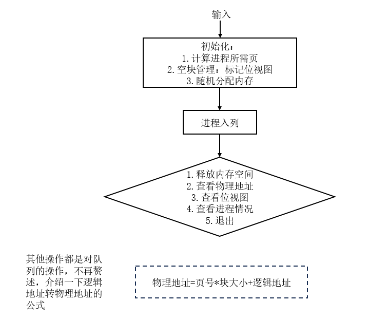
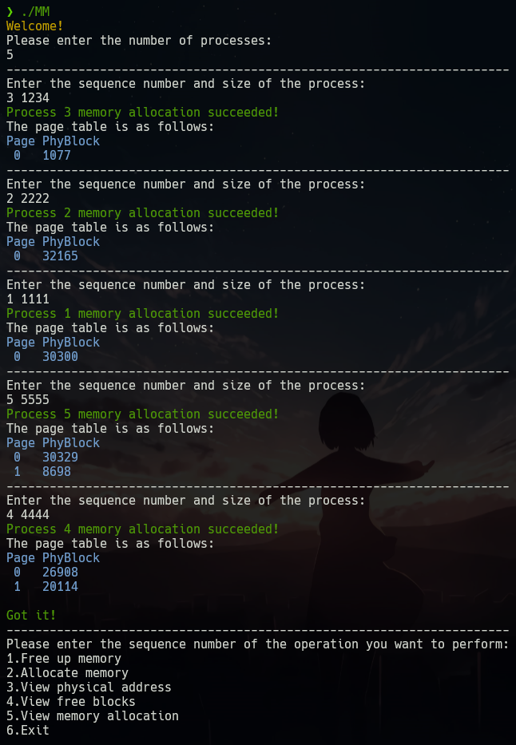
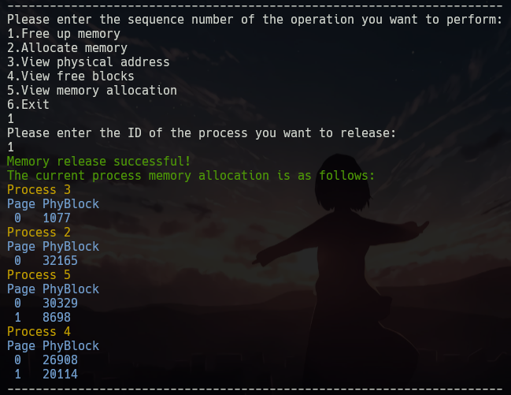
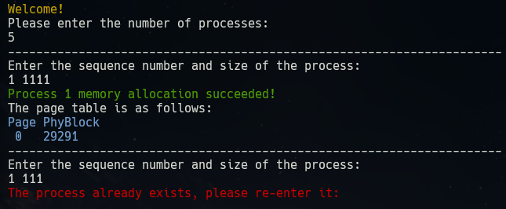

# 实验三：内存管理

## 实验目的

1. 加深对分页存储管理的原理的理解
2. 深入理解分页存储管理如何分配和回收内存
3. 深入理解分页存储管理中的地址变换

## 实验内容

假定页面大小为 4K，物理内存 128M，设计并实现一个内存分配和回收的程序，使用 C 语言或 Python 语言编写程序实现这个程序并进行测试。

要求：

1. 至少5个进程
2. 要求有空块管理
3. 要求有一个逻辑地址到物理地址的变换

## 程序流程图



## 程序代码

完整代码在最后

### 结构体与变量

#### 块大小和数量

```
#define COUNT 32768   //块数量 128M/4K
#define SIZE 4096   //块大小 4*1024
```

#### 位视图

```c
int BLOCK[COUNT];  //物理块状态 0空闲1占用 使用位视图记录空块
int BlankBlockNum=COUNT;  //空块数量
```

#### 进程

```c
typedef struct ProcessList //进程属性
{
	int ID; //进程号
	int Size; //进程大小
	int Pages; //所需页数
	int Page[100]; //页表 
	struct ProcessList *next; //下一进程指针
}Process;
```

#### 进程队列

```c
Process *head=NULL; //进程队列
```

### 函数

#### 初始化进程、分配内存

```c
void InitProcess() //初始化进程
{
	int num,RandomNumber;
	printf("Please enter the number of processes:\n"); 
	scanf("%d",&num);
    if(num<5)
    {
        yellow_printf("The number of processes is at least 5, please re-enter it:\n");
        // num=0;
        scanf("%d",&num);
    }
	Process *temp;
	for(int i=0;i<num;i++)
	{
		temp = (Process*)malloc(sizeof(Process));
        printf("----------------------------------------------------------------------\n");
		printf("Enter the sequence number and size of the process:\n");
		scanf("%d %d",&temp->ID,&temp->Size);
		if(i>0)
		{
			Process *check;
			check=head;
			while (check != NULL)
			{
				if(temp->ID==check->ID)
				{
					red_printf("The process already exists, please re-enter it:\n");
					scanf("%d %d",&temp->ID,&temp->Size);
					if(temp->ID!=check->ID) break;
					else continue;
				}
				check=check->next;
			}
		}
        //计算进程所需的页数
		if(temp->Size%SIZE==0) //能整除
		{
			temp->Pages = temp->Size/SIZE; 
		}
		else //不足一页的部分另起一页
		{
			temp->Pages = temp->Size/SIZE+1;
		}
		temp->next = NULL;
		//空块管理 
		if(temp->Pages<BlankBlockNum)
		{
			BlankBlockNum -=temp->Pages;
		}
		else
		{
			red_printf("Sorry,there is not enough memory space to allocate!\n"); 
		}
		//分配内存 
		for(int j=0;j<temp->Pages;j++)
		{
			srand(time(0)); //随机数种子
			while(1)
			{
                //模拟实际内存分配不连续性（随机分配）
				RandomNumber = rand()%32768;
				if(BLOCK[RandomNumber]==0)
				{
					temp->Page[j] = RandomNumber;
					BLOCK[RandomNumber] = 1;
					break;
				}
				else
				{
					continue;
				}
			}
		} 
		green_printf("Process %d memory allocation succeeded!\n",temp->ID);
		printf("The page table is as follows:\n");
		blue_printf("Page PhyBlock\n"); 
		for(int j=0;j<temp->Pages;j++)
		{
			blue_printf(" %d   %d\n",j,temp->Page[j]);
		}
		//放入进程链表 
		if(head == NULL)
		{
			head = temp;
			temp = NULL;
		}
		else
		{
			Process *temp2;
			temp2 = head;
			while(temp2->next != NULL)
			{
				temp2 = temp2->next;
			}
			temp2->next = temp;
			temp = NULL;
		}
	}
}
```

#### 释放内存

```c
void Release(int id)
{
	Process *temp,*temp1,*temp2;
	temp = head;
	temp1 = head->next;
	if(temp->ID == id)
	{
		for(int i=0;i<temp->Pages;i++)
		{
			BLOCK[temp->Page[i]] = 0;
			BlankBlockNum++;
		}
		head = temp1;
		free(temp);
		green_printf("Memory release successful!\n");
	}
	else
	{
		while(temp1)
		{
			if(temp1->ID == id)
			{
				for(int i=0;i<temp1->Pages;i++)
				{
					BLOCK[temp1->Page[i]] = 0;
					BlankBlockNum++;
				}
				
				green_printf("Memory release successful!\n");
				temp->next = temp1->next;
				free(temp1);
				break;
			}
			else
			{
				temp = temp1;
				temp1=temp1->next;
			}
		}
	}
	temp2 = head;
	printf("The current process memory allocation is as follows:\n");
	while(temp2 != NULL)
	{
		yellow_printf("Process %d\n",temp2->ID);
		blue_printf("Page PhyBlock\n"); 
		for(int j=0;j<temp2->Pages;j++)
		{
			blue_printf(" %d   %d\n",j,temp2->Page[j]);
		}
		temp2 = temp2->next;
	}
} 
```

#### 分配内存

```c
void add()
{
	int RandomNumber;
	Process *temp;
	temp = (Process*)malloc(sizeof(Process));
	// printf("----------------------------------------------------------------------\n");
	printf("Enter the sequence number and size of the process:\n");
	scanf("%d %d",&temp->ID,&temp->Size);

	Process *check;
	check=head;
	while (check != NULL)
	{
		if(temp->ID==check->ID)
		{
			red_printf("The process already exists, please re-enter it:\n");
			scanf("%d %d",&temp->ID,&temp->Size);
			if(temp->ID!=check->ID) break;
			else continue;
		}
		check=check->next;
	}
	
	//计算进程所需的页数
	if(temp->Size%SIZE==0) //能整除
	{
		temp->Pages = temp->Size/SIZE; 
	}
	else //不足一页的部分另起一页
	{
		temp->Pages = temp->Size/SIZE+1;
	}
	temp->next = NULL;
	//空块管理 
	if(temp->Pages<BlankBlockNum)
	{
		BlankBlockNum -=temp->Pages;
	}
	else
	{
		red_printf("Sorry,there is not enough memory space to allocate!\n"); 
	}
	//分配内存 
	for(int j=0;j<temp->Pages;j++)
	{
		srand(time(0)); //随机数种子
		while(1)
		{
			//模拟实际内存分配不连续性（随机分配）
			RandomNumber = rand()%32768;
			if(BLOCK[RandomNumber]==0)
			{
				temp->Page[j] = RandomNumber;
				BLOCK[RandomNumber] = 1;
				break;
			}
			else
			{
				continue;
			}
		}
	} 
	green_printf("Process %d memory allocation succeeded!\n",temp->ID);
	printf("The page table is as follows:\n");
	blue_printf("Page PhyBlock\n"); 
	for(int j=0;j<temp->Pages;j++)
	{
		blue_printf(" %d   %d\n",j,temp->Page[j]);
	}
	//放入进程链表 
	if(head == NULL)
	{
		head = temp;
		temp = NULL;
	}
	else
	{
		Process *temp2;
		temp2 = head;
		while(temp2->next != NULL)
		{
			temp2 = temp2->next;
		}
		temp2->next = temp;
		temp = NULL;
	}
}
```

#### 逻辑地址转物理地址

```c
void AddressTranslation(int id,int LogAddress)
{
	int PhyAddress,P,W;
	Process *temp;
	temp = head;
	while(temp != NULL)
	{
		if(temp->ID == id)
		{
			if(LogAddress > temp->Size)
			{
				red_printf("Break out of bounds!\n");
				break; 
			}
			else
			{
				//物理地址=页号*块大小(4K)+偏移量(逻辑地址)
				P = LogAddress / SIZE;
				W = LogAddress % SIZE;
				PhyAddress = temp->Page[P]*SIZE+W;
				purple_printf("Calculator: PhyAddress=%d×4K+%d\n",temp->Page[P],W);
				yellow_printf("PhyAddress:%d\n",PhyAddress);
			}
			break;
		}
		else
		{
			temp = temp->next;
		}
	}
	if(temp == NULL)
	{
		red_printf("The process does not exist!\n");
	}
}
```

#### 其他

```c
void showBlocks()； // 显示空块数和占用数
void showMemory()； // 显示内存分配
```

#### 主函数

```c
int main()
{
	yellow_printf("Welcome!\n");
	InitProcess(); //初始化进程并分配内存
	//Manage();
	int n,id,LogAddress;
	while(1)
	{
		printf("----------------------------------------------------------------------\n");
		printf("Please enter the sequence number of the operation you want to perform:\n1.Free up memory\n2.View physical address\n3.View free blocks\n4.Exit\n");
		scanf("%d",&n);
		switch(n)
		{
			case 1:
				printf("Please enter the ID of the process you want to release:\n");
				scanf("%d",&id);
				Release(id);
				break;
			case 2:
				printf("Enter the process ID and logical address:\n");
				scanf("%d %d",&id,&LogAddress);
				AddressTranslation(id,LogAddress);
				break;
			case 3:
				showBlocks();
				break;
			case 4:
				yellow_printf("Have a nice day!\n");
				exit(0);
				break;
			default:
				red_printf("Error!Without this choice!\n");
				break; 
		}
	}
	return 0;	
}
```

## 运行结果

#### 创新点

1. 支持动态维护管理
2. 支持实时向内存添加和释放进程
3. 可以随时查看当前内存分配和空块数
4. 程序输出字体颜色根据提示信息有所不同

#### 初始化



#### 查看进程 1 物理地址


#### 释放进程 1 内存空间



#### 再次查看进程 1


发现进程不存在

#### 查看当前内存分配


#### 添加进程


#### 退出程序


## 规范性输入

#### 实验要求进程数至少为5


#### 进程重复



#### 逻辑地址溢出


#### 查看不存在进程的物理地址


#### 释放不存在进程内存


## 遇到问题

#### 问题 1

第一版的程序没有考虑内存分配时的随机性

#### 解决方案 1

时间作为随机数种子，模拟进程内存的随机分配

#### 问题 2

进程大小 Size 只能以 bit 为单位，与实际不太相符

#### 解决方案 2

实现自定义进程大小单位

## 结果分析

#### 测试用例

```
ProcessID  Size(bit)
	3		1234
	2		2222
	1		1111
	5		5555
	4		4444
```

初始化

1. 计算进程所需页数
2. 空块管理，即位视图相应位置 1
3. 进行内存分配
4. 进入进程队列

操作选项当中本次实验的重点就是逻辑地址与物理地址的转换

计算公式：物理地址 = 页号 * 块（页）大小 + 逻辑地址（偏移量）

经过分析，运行结果市正确的，程序完全符合本次实验要求

## 完整代码

```c
#include<stdio.h>
#include<stdlib.h>
#include<time.h>
#include <stdarg.h> //确保包含了这个头文件
#define COUNT 32768   //块数量 128M/4K
#define SIZE 4096   //块大小 4*1024

int BLOCK[COUNT];  //物理块状态 0空闲1占用 使用位视图记录空块
int BlankBlockNum=COUNT;  //空块数量

typedef struct ProcessList //进程属性
{
	int ID; //进程号
	int Size; //进程大小
	int Pages; //所需页数
	int Page[100]; //页表 
	struct ProcessList *next; //下一进程指针
}Process;

Process *head=NULL; //进程队列

//输出颜色字体
void color_printf(const char* color_code, const char* format, ...) {
    va_list args;
    printf("%s", color_code); // 设置颜色
    va_start(args, format);
    vprintf(format, args); // 打印格式化的文本
    va_end(args);
    printf("\033[0m"); // 重置到默认颜色
}
void red_printf(const char* format, ...) {
    va_list args;
    printf("\033[31m");
    va_start(args, format);
    vprintf(format, args);
    va_end(args);
    printf("\033[0m");
}
void blue_printf(const char* format, ...)
{
    va_list args;
    printf("\033[1;34m");
    va_start(args, format);
    vprintf(format, args);
    va_end(args);
    printf("\033[0m");
}
void green_printf(const char* format, ...) 
{
    va_list args;
    printf("\033[32m");
    va_start(args, format);
    vprintf(format, args);
    va_end(args);
    printf("\033[0m");
}
void darkgreen_printf(const char* format, ...) 
{
    va_list args;
    printf("\033[36m");
    va_start(args, format);
    vprintf(format, args);
    va_end(args);
    printf("\033[0m");
}
void yellow_printf(const char* format, ...) 
{
    va_list args;
    printf("\033[33m");
    va_start(args, format);
    vprintf(format, args);
    va_end(args);
    printf("\033[0m");
}
void purple_printf(const char* format, ...) 
{
    va_list args;
    printf("\033[35m");
    va_start(args, format);
    vprintf(format, args);
    va_end(args);
    printf("\033[0m");
}
void InitProcess() //初始化进程
{
	int num,RandomNumber;
	printf("Please enter the number of processes:\n"); 
	scanf("%d",&num);
    if(num<5)
    {
        yellow_printf("The number of processes is at least 5, please re-enter it:\n");
        // num=0;
        scanf("%d",&num);
    }
	Process *temp;
	for(int i=0;i<num;i++)
	{
		temp = (Process*)malloc(sizeof(Process));
        printf("----------------------------------------------------------------------\n");
		printf("Enter the sequence number and size of the process:\n");
		scanf("%d %d",&temp->ID,&temp->Size);
		if(i>0)
		{
			Process *check;
			check=head;
			while (check != NULL)
			{
				if(temp->ID==check->ID)
				{
					red_printf("The process already exists, please re-enter it:\n");
					scanf("%d %d",&temp->ID,&temp->Size);
					if(temp->ID!=check->ID) break;
					else continue;
				}
				check=check->next;
			}
		}
        //计算进程所需的页数
		if(temp->Size%SIZE==0) //能整除
		{
			temp->Pages = temp->Size/SIZE; 
		}
		else //不足一页的部分另起一页
		{
			temp->Pages = temp->Size/SIZE+1;
		}
		temp->next = NULL;
		//空块管理 
		if(temp->Pages<BlankBlockNum)
		{
			BlankBlockNum -=temp->Pages;
		}
		else
		{
			red_printf("Sorry,there is not enough memory space to allocate!\n"); 
		}
		//分配内存 
		for(int j=0;j<temp->Pages;j++)
		{
			srand(time(0)); //随机数种子
			while(1)
			{
                //模拟实际内存分配不连续性（随机分配）
				RandomNumber = rand()%32768;
				if(BLOCK[RandomNumber]==0)
				{
					temp->Page[j] = RandomNumber;
					BLOCK[RandomNumber] = 1;
					break;
				}
				else
				{
					continue;
				}
			}
		} 
		green_printf("Process %d memory allocation succeeded!\n",temp->ID);
		printf("The page table is as follows:\n");
		blue_printf("Page PhyBlock\n"); 
		for(int j=0;j<temp->Pages;j++)
		{
			blue_printf(" %d   %d\n",j,temp->Page[j]);
		}
		//放入进程链表 
		if(head == NULL)
		{
			head = temp;
			temp = NULL;
		}
		else
		{
			Process *temp2;
			temp2 = head;
			while(temp2->next != NULL)
			{
				temp2 = temp2->next;
			}
			temp2->next = temp;
			temp = NULL;
		}
	}
}

void add()
{
	int RandomNumber;
	Process *temp;
	temp = (Process*)malloc(sizeof(Process));
	// printf("----------------------------------------------------------------------\n");
	printf("Enter the sequence number and size of the process:\n");
	scanf("%d %d",&temp->ID,&temp->Size);

	Process *check;
	check=head;
	while (check != NULL)
	{
		if(temp->ID==check->ID)
		{
			red_printf("The process already exists, please re-enter it:\n");
			scanf("%d %d",&temp->ID,&temp->Size);
			if(temp->ID!=check->ID) break;
			else continue;
		}
		check=check->next;
	}
	
	//计算进程所需的页数
	if(temp->Size%SIZE==0) //能整除
	{
		temp->Pages = temp->Size/SIZE; 
	}
	else //不足一页的部分另起一页
	{
		temp->Pages = temp->Size/SIZE+1;
	}
	temp->next = NULL;
	//空块管理 
	if(temp->Pages<BlankBlockNum)
	{
		BlankBlockNum -=temp->Pages;
	}
	else
	{
		red_printf("Sorry,there is not enough memory space to allocate!\n"); 
	}
	//分配内存 
	for(int j=0;j<temp->Pages;j++)
	{
		srand(time(0)); //随机数种子
		while(1)
		{
			//模拟实际内存分配不连续性（随机分配）
			RandomNumber = rand()%32768;
			if(BLOCK[RandomNumber]==0)
			{
				temp->Page[j] = RandomNumber;
				BLOCK[RandomNumber] = 1;
				break;
			}
			else
			{
				continue;
			}
		}
	} 
	green_printf("Process %d memory allocation succeeded!\n",temp->ID);
	printf("The page table is as follows:\n");
	blue_printf("Page PhyBlock\n"); 
	for(int j=0;j<temp->Pages;j++)
	{
		blue_printf(" %d   %d\n",j,temp->Page[j]);
	}
	//放入进程链表 
	if(head == NULL)
	{
		head = temp;
		temp = NULL;
	}
	else
	{
		Process *temp2;
		temp2 = head;
		while(temp2->next != NULL)
		{
			temp2 = temp2->next;
		}
		temp2->next = temp;
		temp = NULL;
	}
}

void showMemory()
{
	Process *Memorytemp;
	Memorytemp = head;
	green_printf("The current process memory allocation is as follows:\n");
	while(Memorytemp != NULL)
	{
		yellow_printf("Process %d\n",Memorytemp->ID);
		blue_printf("Page PhyBlock\n"); 
		for(int j=0;j<Memorytemp->Pages;j++)
		{
			blue_printf(" %d   %d\n",j,Memorytemp->Page[j]);
		}
		Memorytemp = Memorytemp->next;
	}
}

void Release(int id)
{
	Process *temp,*temp1,*temp2;
	temp = head;
	temp1 = head->next;
	if(temp->ID == id)
	{
		for(int i=0;i<temp->Pages;i++)
		{
			BLOCK[temp->Page[i]] = 0;
			BlankBlockNum++;
		}
		head = temp1;
		free(temp);
		green_printf("Memory release successful!\n");
	}
	else
	{
		while(temp1)
		{
			if(temp1->ID == id)
			{
				for(int i=0;i<temp1->Pages;i++)
				{
					BLOCK[temp1->Page[i]] = 0;
					BlankBlockNum++;
				}
				
				green_printf("Memory release successful!\n");
				temp->next = temp1->next;
				free(temp1);
				break;
			}
			else
			{
				temp = temp1;
				temp1=temp1->next;
			}
		}
	}
	if(temp1==NULL)
	{
		red_printf("The process does not exist!\n");
	}
	else
	{
		showMemory();
	}
} 
void AddressTranslation(int id,int LogAddress)
{
	int PhyAddress,P,W;
	Process *temp;
	temp = head;
	while(temp != NULL)
	{
		if(temp->ID == id)
		{
			if(LogAddress > temp->Size)
			{
				red_printf("Break out of bounds!\n");
				break; 
			}
			else
			{
				//物理地址=页号*块大小(4K)+偏移量(逻辑地址)
				P = LogAddress / SIZE;
				W = LogAddress % SIZE;
				PhyAddress = temp->Page[P]*SIZE+W;
				purple_printf("Calculator: PhyAddress=%d×4K+%d\n",temp->Page[P],W);
				yellow_printf("PhyAddress:%d\n",PhyAddress);
			}
			break;
		}
		else
		{
			temp = temp->next;
		}
	}
	if(temp == NULL)
	{
		red_printf("The process does not exist!\n");
	}
}

void showBlocks()
{
	int count=0;
	Process *temp;
	temp=head;
	while (temp != NULL)
	{
		count+=temp->Pages;
		temp=temp->next;
	}
	darkgreen_printf("Free Blocks:%d\n",COUNT-count);
	purple_printf("Occupy Blocks:%d\n",count);
}

int main()
{
	yellow_printf("Welcome!\n");
	InitProcess(); //初始化进程并分配内存
	green_printf("\nGot it!\n");
	int n,id,LogAddress;
	while(1)
	{
		printf("----------------------------------------------------------------------\n");
		printf("Please enter the sequence number of the operation you want to perform:\n1.Free up memory\n2.Allocate memory\n3.View physical address\n4.View free blocks\n5.View memory allocation\n6.Exit\n");
		scanf("%d",&n);
		switch(n)
		{
			case 1:
				printf("Please enter the ID of the process you want to release:\n");
				scanf("%d",&id);
				Release(id);
				break;
			case 2:
				add();
				break;
			case 3:
				printf("Enter the process ID and logical address:\n");
				scanf("%d %d",&id,&LogAddress);
				AddressTranslation(id,LogAddress);
				break;
			case 4:
				showBlocks();
				break;
			case 5:
				showMemory();
				break;
			case 6:
				yellow_printf("Have a nice day!\n");
				exit(0);
				break;
			default:
				red_printf("Error!Without this choice!\n");
				break; 
		}
	}
	return 0;	
}
```


