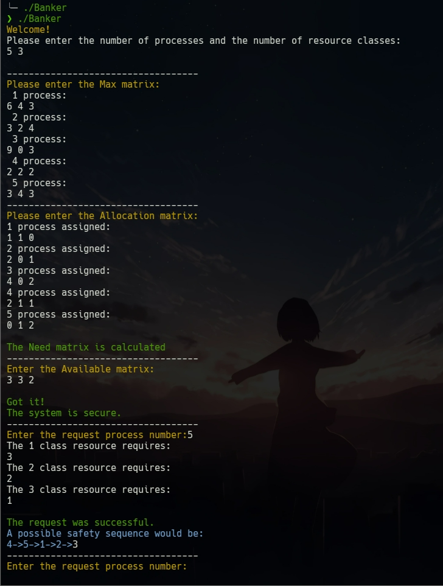

# 实验二：银行家算法

## 实验目的

1. 理解死锁概念，了解导致死锁的原因
2. 掌握死锁的避免算法，理解安全状态和不安全状态的概念
3. 理解银行家算法，并应用银行家算法避免死锁

## 实验内容

假定有多个进程对多种资源进行请求，设计银行家算法的数据结构和程序结构，判定是否存在资源分配的安全序列。使用 C 语言或Python 语言编写程序实现这个算法并进行测试

要求：

1. 至少5个进程
2. 至少3类资源
3. 结果中包含一个安全的请求和一个不安全的请求

## 程序流程图


## 程序代码

本次使用了 C 语言进行程序编写，开发环境：Ubuntu 20.04，主要代码如下，完整代码在本文最后：

### 结构体与变量

#### 最大需求矩阵

```c
int Max[20][20];             // Max[i][j]表示进程i对j类资源的最大需求
```

#### 已分配矩阵

```c
int Allocation[20][20];      // Allocation[i][j]表示已分配给进程i的j类资源数
```

#### 需求矩阵

```c
int Need[20][20];            // Need[i][j]表示进程i当前所需的j类资源数
```

#### 现可分配资源矩阵

```c
int Available[20];           // Available[i]表示第i类资源现有资源数
```

#### 请求列表

```c
int request[20];             // 申请的资源情况
```

#### 试分配后恢复

```c
int AllocationStatus[20];    // 试分配前Allocation的状态
int NeedStatus[20];          // 试分配前Need状态
int AvailableStatus[20];     // 试分配前Available状态
```

#### 其他

```c
int processNum = 5;  // 记录进程个数
int resourceNum = 3; // 记录资源类型个数
int requireNum = 0;  // 申请进程号

int WorkStatus[20];          // 用于检查安全性的工作矩阵
bool Finished[20] = {false}; // 用于记录进程的完成情况
int Safety[20];              // 安全序列
```

### 函数

#### 安全序列判断

```c
bool is_safe() // 安全性判断
{
    int i, j, i1 = 0;
    bool t = false;

    for (i = 0; i < resourceNum; i++) // 把Available赋值给Work
    {
        WorkStatus[i] = Available[i];
    }

    for (i = 0; i < processNum; i++) // 初始化所有进程未完成
    {
        Finished[i] = false;
    }

    while (1)
    {
        for (j = 0; j < processNum; j++) // 寻找Need小于等于Work的进程
        {
            if (Finished[j])
                continue;
            t = true;
            for (i = 0; i < resourceNum; i++)
            {
                if (Need[j][i] <= WorkStatus[i])
                    continue;
                else
                {
                    t = false;
                    break;
                }
            }
            if (t)
                break; // 判断第j个进程是否满足Need小于等于Work
        }

        if (t && (Finished[j] == false)) // 是否找到Need小于等于Work的进程并且进程未完成
        {
            for (i = 0; i < resourceNum; i++)
            {
                WorkStatus[i] = WorkStatus[i] + Allocation[j][i];
            }
            Finished[j] = true; // 进程完成
            Safety[i1] = j+1; // 安全序列
            i1++;
        }
        else
        {
            for (i = 0; i < processNum; i++)
            {
                if (Finished[i])
                    continue;
                else
                    return false;
            }
            return true;
        }
    }
    return true;
}
```

#### 其他

```c
void getMax();         // 获取最大需求矩阵 Max
void getAllocation();  // 获取分配矩阵 Allocation
void getNeed();        // 计算需求矩阵 Need
void getAvailable();   // 获取当前可用资源 Available
```

#### 银行家算法

```c
int main()
{
    // 获取最大需求矩阵 Max
    getMax();
    // 获取分配矩阵 Allocation
    getAllocation();
    // 计算需求矩阵 Need
    getNeed();
    // 获取当前可用资源
    getAvailable();
    // 申请前检查一次
    if(!is_safe())
    {
        red_printf("The current system is not secure!\nResources could not be allocated.\n");
        exit(0);
    }
    else
    {
        green_printf("The system is secure.\n");
        while (1)
        {
            // 获取请求信息
            getRequirement();
            // 检查分配后的安全性
            if(!is_safe())
            {
                red_printf("After allocation, the system is not secure.\nIt has been restored to its original state!\n");
                // 恢复试分配前状态
                for (int i = 0; i < resourceNum; i++)
                {
                    Allocation[requireNum-1][i]=AllocationStatus[i];
                    Need[requireNum-1][i]=NeedStatus[i];
                    Available[i]=AvailableStatus[i];
                }
                continue;
            }
            else
            {
                green_printf("\nThe request was successful.");
                blue_printf("\nA possible safety sequence would be:\n");
                for (int i = 0; i < processNum-1; i++)
                {
                    blue_printf("%d->", Safety[i]);
                }
                printf("%d\n",Safety[processNum-1]);
            }
            // getchar();
        }
    }
    return 0;
}
```

## 运行结果

传入的进程信息见上述代码

#### 创新点

1. 该程序可持续对输入案例进行多次请求，会动态维护资源，只要请求合理，就能不断申请
2. 如果申请不符合要求，程序会恢复分配前状态
3. 分配完成后输出分配完以后的资源情况
4. 程序输出字体颜色根据提示信息有所不同

#### 可行案例（实验提供案例）



已修复：安全队列输出的最后一个进程为白色

从上面的结果可以判断，进程 P4 申请（3，2，1）后存在安全序列

查看分配后资源情况：


当申请超过可分配资源时，进程等待：


#### 不可行案例（课程 PPT 案例）


## 规范性输入

本实验要求进程数至少为5，资源类至少为3


当请求进程号超过进程数时


## 遇到问题

## 结果分析

## 完整代码

```c
#include <stdio.h>
#include <stdlib.h>
#include <math.h>
#include <stdbool.h>
#include <stdarg.h>

int processNum = 5;  // 记录进程个数
int resourceNum = 3; // 记录资源类型个数
int requireNum = 0;  // 申请进程号

// 使用的数据结构
int Max[20][20];             // Max[i][j]表示进程i对j类资源的最大需求
int Allocation[20][20];      // Allocation[i][j]表示已分配给进程i的j类资源数
int Need[20][20];            // Need[i][j]表示进程i当前所需的j类资源数
int Available[20];           // Available[i]表示第i类资源现有资源数
int request[20];             // 申请的资源情况
int WorkStatus[20];          // 用于检查安全性的工作矩阵
bool Finished[20] = {false}; // 用于记录进程的完成情况
int Safety[20];              // 安全序列
int AllocationStatus[20];    // 试分配前Allocation的状态
int NeedStatus[20];          // 试分配前Need状态
int AvailableStatus[20];     // 试分配前Available状态

//输出颜色字体
void color_printf(const char* color_code, const char* format, ...) {
    va_list args;
    printf("%s", color_code); // 设置颜色
    va_start(args, format);
    vprintf(format, args); // 打印格式化的文本
    va_end(args);
    printf("\033[0m"); // 重置到默认颜色
}
void red_printf(const char* format, ...) {
    va_list args;
    printf("\033[31m");
    va_start(args, format);
    vprintf(format, args);
    va_end(args);
    printf("\033[0m");
}
void blue_printf(const char* format, ...)
{
    va_list args;
    printf("\033[1;34m");
    va_start(args, format);
    vprintf(format, args);
    va_end(args);
    printf("\033[0m");
}
void green_printf(const char* format, ...) 
{
    va_list args;
    printf("\033[32m");
    va_start(args, format);
    vprintf(format, args);
    va_end(args);
    printf("\033[0m");
}
void darkgreen_printf(const char* format, ...) 
{
    va_list args;
    printf("\033[36m");
    va_start(args, format);
    vprintf(format, args);
    va_end(args);
    printf("\033[0m");
}
void yellow_printf(const char* format, ...) 
{
    va_list args;
    printf("\033[33m");
    va_start(args, format);
    vprintf(format, args);
    va_end(args);
    printf("\033[0m");
}
void purple_printf(const char* format, ...) 
{
    va_list args;
    printf("\033[35m");
    va_start(args, format);
    vprintf(format, args);
    va_end(args);
    printf("\033[0m");
}

// 获取最大需求矩阵 Max
void getMax()
{
    yellow_printf("Welcome!\n");
    printf("Please enter the number of processes and the number of resource classes:\n");
    while (1)
    {
        scanf("%d %d", &processNum, &resourceNum);
        // 针对本次实验的参数要求验证
        if (processNum < 5)
        {
            red_printf("\nIf the number of processes is at least 5, enter them again.\n");
            continue;
        }
        if (resourceNum < 3)
        {
            red_printf("\nThe resource category is at least 3, please re-enter it.\n");
            continue;
        }
        break;
    }
    printf("\n-----------------------------------\n");
    yellow_printf("Please enter the Max matrix:\n");
    for (int i = 0; i < processNum; i++)
    {
        printf("%2d process:\n", i + 1);
        for (int j = 0; j < resourceNum; j++)
        {
            // int maxij=0;
            scanf("%d", &Max[i][j]);
        }
        // printf("\n");
    }
}

// 获取已分配资源
void getAllocation()
{
    printf("-----------------------------------\n");
    yellow_printf("Please enter the Allocation matrix:\n");
    for (int i = 0; i < processNum; i++)
    {
        printf("%d process assigned:\n", i + 1);
        for (int j = 0; j < resourceNum; j++)
        {
            // int maxij=0;
            scanf("%d", &Allocation[i][j]);
        }
        // printf("\n");
    }
}

// 计算需求矩阵，这一部分可以和获取资源分配同时进行，减少循环次数，这里分开写显示逻辑性
void getNeed()
{
    for (int i = 0; i < processNum; i++)
    {
        for (int j = 0; j < resourceNum; j++)
        {
            Need[i][j] = Max[i][j] - Allocation[i][j];
        }
    }
    green_printf("\nThe Need matrix is calculated\n");
}

void getAvailable()
{
    printf("-----------------------------------\n");
    yellow_printf("Enter the Available matrix:\n");
    for (int i = 0; i < resourceNum; i++)
    {
        scanf("%d", &Available[i]);
    }
    green_printf("\nGot it!\n");
}
// 接收资源请求
void getRequirement()
{
    printf("-----------------------------------\n");
    yellow_printf("Enter the request process number:");
    // int pnum=0;
    scanf("%d", &requireNum);
    while(requireNum>processNum)
    {
        red_printf("\nOps!This process does not exist!\nPlease re-enter it:");
        scanf("%d",&requireNum);
    }
    Safety[0] = requireNum;
    for (int i = 0; i < resourceNum; i++)
    {
        printf("The %d class resource requires:\n", i + 1);
        // int num=0;
        scanf("%d", &request[i]);
        if (request[i] > Need[requireNum - 1][i])
        {
            red_printf("\nError\nThe number of resources requested is more than the current need!\nDon't be too greedy!\n");
            getRequirement();
        }
        if (request[i] > Available[i])
        {
            red_printf("\nProcess %d is blocked\n", requireNum);
            getRequirement();
        }
        else
        {
            // 保留现场
            AvailableStatus[i]=Available[i];
            AllocationStatus[i]=Allocation[requireNum-1][i];
            NeedStatus[i]=Need[requireNum-1][i]; 
            // 试分配
            Available[i] -= request[i];
            Allocation[requireNum - 1][i] += request[i];
            Need[requireNum - 1][i] -= request[i];
            Finished[requireNum - 1] = true;
        }
    }
}

bool is_safe() // 安全性判断
{
    int i, j, i1 = 0;
    bool t = false;

    for (i = 0; i < resourceNum; i++) // 把Available赋值给Work
    {
        WorkStatus[i] = Available[i];
    }

    for (i = 0; i < processNum; i++) // 初始化所有进程未完成
    {
        Finished[i] = false;
    }

    while (1)
    {
        for (j = 0; j < processNum; j++) // 寻找Need小于等于Work的进程
        {
            if (Finished[j])
                continue;
            t = true;
            for (i = 0; i < resourceNum; i++)
            {
                if (Need[j][i] <= WorkStatus[i])
                    continue;
                else
                {
                    t = false;
                    break;
                }
            }
            if (t)
                break; // 判断第j个进程是否满足Need小于等于Work
        }

        if (t && (Finished[j] == false)) // 是否找到Need小于等于Work的进程并且进程未完成
        {
            for (i = 0; i < resourceNum; i++)
            {
                WorkStatus[i] = WorkStatus[i] + Allocation[j][i];
            }
            Finished[j] = true; // 进程完成
            Safety[i1] = j+1; // 安全序列
            i1++;
        }
        else
        {
            for (i = 0; i < processNum; i++)
            {
                if (Finished[i])
                    continue;
                else
                    return false;
            }
            return true;
        }
    }
    return true;
}

void showResource()
{
    printf("-------------------------------------------\n");
    red_printf("Current resource situation\n");
    yellow_printf("process      Max      Allocation     Need\n          ");
    for(int i=0;i<3;i++)
    {
        for(int j=0;j<resourceNum;j++)
        {
            yellow_printf("r%d ",j+1);
        }
        printf("    ");
    }
    printf("\n");
    for(int i=0;i<processNum;i++)
    {
        yellow_printf("P%d       ",i+1);
        for(int j=0;j<resourceNum;j++)
        {
            printf("%2d ",Max[i][j]);
        }
        printf("    ");
        for(int j=0;j<resourceNum;j++)
        {
            printf("%2d ",Allocation[i][j]);
        }
        printf("    ");
        for(int j=0;j<resourceNum;j++)
        {
            printf("%2d ",Need[i][j]);
        }
        printf("\n");
    }
}

void showAvailable()
{
    yellow_printf("\nAvailable\n");
    for(int i=0;i<resourceNum;i++)
    {
        yellow_printf("r%d ",i+1);
    }
    printf("\n");
    for(int i=0;i<resourceNum;i++)
    {
        printf("%2d ",Available[i]);
    }
    printf("\n");
}

int main()
{
    // 获取最大需求矩阵 Max
    getMax();
    // 获取分配矩阵 Allocation
    getAllocation();
    // 计算需求矩阵 Need
    getNeed();
    // 获取当前可用资源
    getAvailable();
    // 申请前检查一次
    if(!is_safe())
    {
        red_printf("The current system is not secure!\nResources could not be allocated.\n");
        exit(0);
    }
    else
    {
        green_printf("The system is secure.\n");
        while (1)
        {
            // 获取请求信息
            getRequirement();
            // 检查分配后的安全性
            if(!is_safe())
            {
                red_printf("After allocation, the system is not secure.\nIt has been restored to its original state!\n");
                // 恢复试分配前状态
                for (int i = 0; i < resourceNum; i++)
                {
                    Allocation[requireNum-1][i]=AllocationStatus[i];
                    Need[requireNum-1][i]=NeedStatus[i];
                    Available[i]=AvailableStatus[i];
                }
                continue;
            }
            else
            {
                green_printf("\nThe request was successful.");
                blue_printf("\nA possible safety sequence would be:\n");
                for (int i = 0; i < processNum-1; i++)
                {
                    blue_printf("%d->", Safety[i]);
                }
                blue_printf("%d\n",Safety[processNum-1]);
                // 输出当前资源情况
                showResource();
                showAvailable();
            }
            // getchar();
        }
    }
    return 0;
}
```

